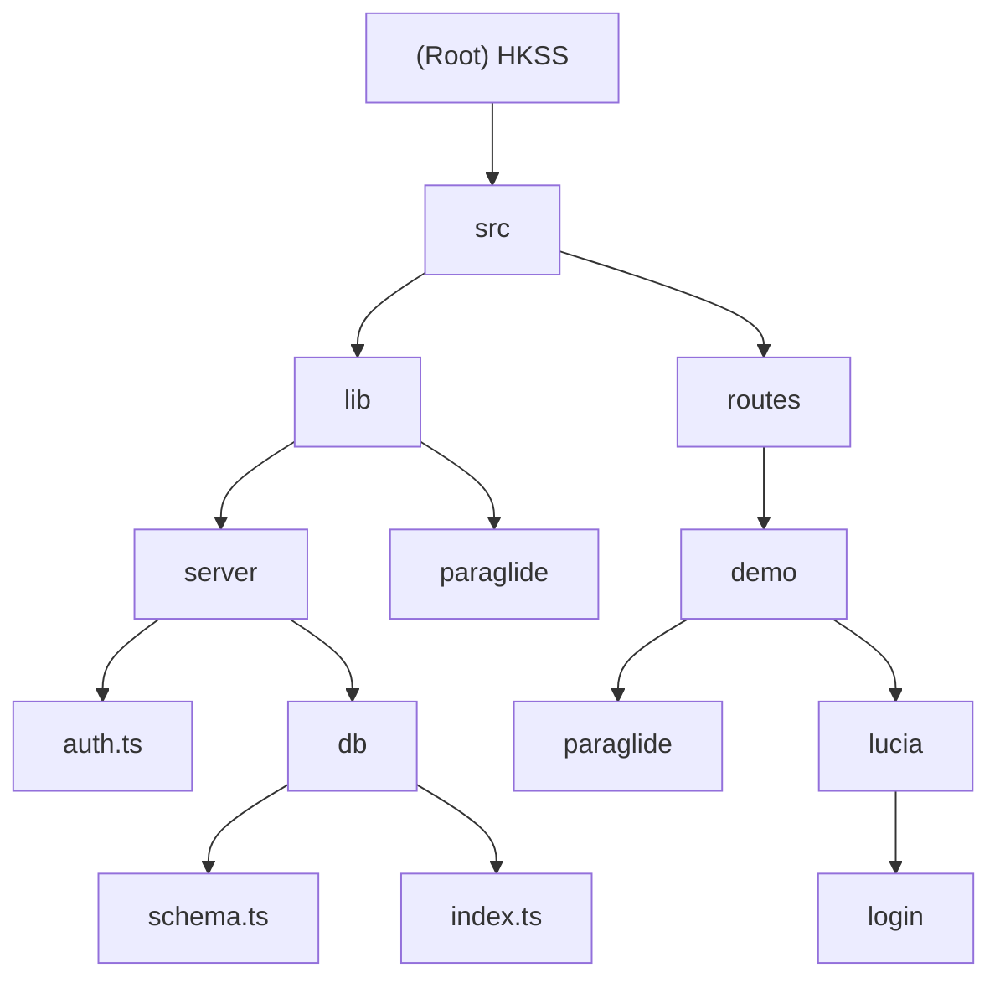

# HKSS - SvelteKit Starter Project

## Project Vision

HKSS is a modern SvelteKit starter template showcasing authentication,
internationalization, database integration, and testing capabilities. It serves
as a comprehensive foundation for building full-stack web applications with
SvelteKit.

## Architecture Overview

This is a single-module SvelteKit application with the following key features:

- **Frontend**: Svelte 5 with TypeScript and Tailwind CSS
- **Backend**: SvelteKit server-side capabilities with PostgreSQL database
- **Authentication**: Custom session-based auth using Argon2 password hashing
- **Internationalization**: Paraglide.js for multi-language support
  (English/Chinese)
- **Database**: PostgreSQL with Drizzle ORM
- **Testing**: Vitest for unit tests and Playwright for E2E tests
- **Styling**: Tailwind CSS with forms and typography plugins



## Module Index

| Module                   | Path                 | Responsibility             | Technology              |
| ------------------------ | -------------------- | -------------------------- | ----------------------- |
| **Main Application**     | `/src`               | Core SvelteKit application | Svelte 5, TypeScript    |
| **Server Logic**         | `/src/lib/server`    | Authentication & database  | Drizzle ORM, PostgreSQL |
| **Internationalization** | `/src/lib/paraglide` | Multi-language support     | Paraglide.js            |
| **Demo Routes**          | `/src/routes/demo`   | Feature demonstrations     | SvelteKit               |

## Running and Development

### Prerequisites

- Node.js (v18+)
- pnpm package manager
- PostgreSQL (via Docker or local installation)

### Development Setup

```bash
# Install dependencies
pnpm install

# Start database
pnpm db:start

# Push database schema
pnpm db:push

# Start development server
pnpm dev
```

### Database Management

```bash
# Start PostgreSQL via Docker
pnpm db:start

# Generate migration files
pnpm db:generate

# Run migrations
pnpm db:migrate

# Push schema changes (development)
pnpm db:push

# Open Drizzle Studio
pnpm db:studio
```

### Build and Deployment

```bash
# Build for production
pnpm build

# Preview production build
pnpm preview
```

## Testing Strategy

### Unit Testing

- **Framework**: Vitest with browser testing capabilities
- **Client Tests**: Browser environment with Playwright provider
- **Server Tests**: Node.js environment
- **Location**: `src/**/*.spec.ts` files
- **Command**: `pnpm test:unit`

### End-to-End Testing

- **Framework**: Playwright
- **Location**: `e2e/` directory
- **Command**: `pnpm test:e2e`

### Test Configuration

- Client tests run in Chromium browser
- Server tests run in Node.js environment
- Tests are automatically excluded from server builds

## Coding Standards

### TypeScript

- Strict mode enabled
- ES module resolution
- SvelteKit-generated types extended in `src/app.d.ts`

### ESLint & Prettier

- TypeScript ESLint configuration
- Svelte-specific linting rules
- Prettier for code formatting
- Pre-commit hooks via pnpm scripts

### File Organization

- Server-side code in `src/lib/server/`
- Database schema in `src/lib/server/db/schema.ts`
- Routes follow SvelteKit file-based routing
- Shared components in `src/lib/`

## AI Usage Guidelines

### Project Understanding

- This is a demonstration template, not a production application
- Database credentials are hardcoded for development
- Authentication implementation is for demonstration purposes
- Internationalization uses Paraglide.js runtime

### Development Context

- Single monolithic application structure
- No external microservices or packages
- All configuration files are in the root directory
- Docker Compose for local PostgreSQL development

### Security Considerations

- Session-based authentication with secure cookies
- Argon2 password hashing with recommended parameters
- Database connection through Drizzle ORM
- Environment variables should be used in production

## Change Log (Changelog)

### 2025-09-14 - Initial Documentation

- Created comprehensive project documentation
- Added module structure diagram
- Documented authentication flow
- Added internationalization setup details
- Included testing and development workflows
